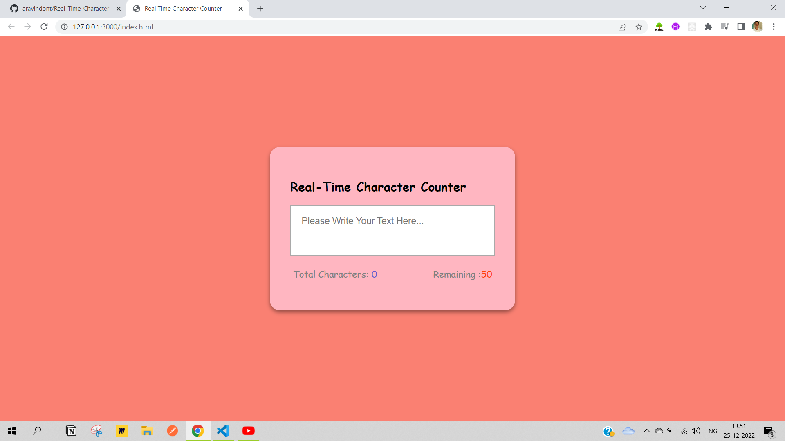

# Real Time Character Counter

## Wireframe


## HTML5

- Created the `index.html` file to add the markup to our website using `HTML5`.

- Added the `Boilerplate code` using `Emmet` by just giving `!` in the starting of the file.

## CSS3

- Created the `styles.css` file to add the styles to our website using `CSS3` first we need to link the `styles.css` file with `index.html` file using the `link tag` like below.

```html
<link rel="stylesheet" href="styles.css" />
```

## JavaScript

- Created the `index.js` file to the `JavaScript` code to the application and to make to functional

- To link the `js` file and the `html` file we need add the below `script` tag before the end of `html` page i.e, before the `body` tag so that our `script` file will have the access to all the `dom` elements

```html
<script src="./index.js"></script>
```

- Used `DOM`(Document Object Model) manupulation techniques and javascript concepts

- Used `addEventListener` method to listen to the changes in the text-area input and latter caluclated the length of the words entered inside the textarea to update the value of `Total Characters` and `Remaining Characters` values

Final Look:


